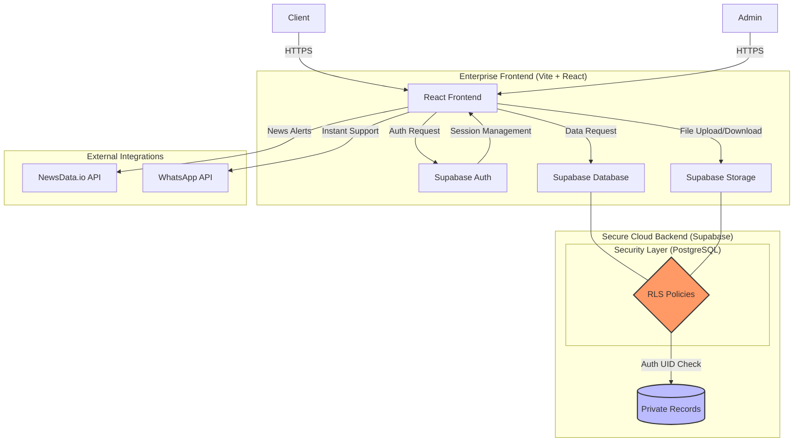

# 🏢 JN Shah Associates: Enterprise-Grade CA Platform
> **A Digital Transformation for Professional Excellence**

[](https://reactjs.org/)
[](https://supabase.com/)
[](https://tailwindcss.com/)
[](LICENSE)

A high-performance, secure, and ICAI-compliant digital ecosystem designed specifically for **JN Shah Associates**. This platform bridges the gap between traditional professional integrity and modern digital efficiency.

---

## 📊 System Architecture & Data Flow

Our architecture prioritizes **Security-First** principles, ensuring that sensitive financial data is isolated and protected at the database level.



---

## 🌟 Key Features

### 🔐 Secure Client Portal (The "Vault")
- **Row Level Security (RLS)**: Database-enforced isolation ensuring clients can *only* access their own files.
- **Enterprise Storage**: Private bucket for high-integrity document management (PAN, GST, Audit reports).
- **Session Management**: Automated session termination on tab closure for maximum security.

### 💼 Professional Services Hub
- **Statutory Updates**: Live "Regulatory Radar" fetching real-time tax and finance alerts.
- **Service Verticals**: Deep-dive pages for Direct Tax, GST, Audit, and Advisory.
- **Knowledge Center**: A centralized repository for firm insights and SEO-optimized articles.

### 🛠️ Administrative Control
- **Master Dashboard**: Unified view for the firm's partners to manage client folders and deadlines.
- **Global Broadcasts**: System-wide notifications for significant tax deadline changes.
- **Document Review**: Streamlined workflow for verifying and approving client-uploaded records.

---

## 🛠️ Technology Stack

| Layer | Technology | Purpose |
| :--- | :--- | :--- |
| **Frontend** | React 19 + Vite | High-performance SPA with fast refresh |
| **Logic** | JavaScript (ES6+) | Robust client-side application logic |
| **Styling** | Tailwind CSS | Premium, custom-branded design system |
| **Animation** | Framer Motion | Smooth Transitions & Micro-interactions |
| **Backend** | Supabase (Postgres) | Enterprise-grade database and security |
| **Storage** | Supabase Vault | Encrypted file storage for financial docs |
| **Icons** | Lucide React | High-quality, consistent UI iconography |

---

## 📂 Project Organization

```text
e:/CA/
├── src/
│   ├── components/         # Atomic UI components and Layouts
│   │   └── dashboard/      # Portal-specific logic (Modals, Tables)
│   ├── pages/              # Primary route components
│   │   └── services/       # Deep service logic (Tax, Audit, etc.)
│   ├── lib/                # Supabase Client & External Configs
│   └── App.jsx             # Unified Routing with AnimatePresence
├── DEPLOYMENT_GUIDE.md     # Production deployment instructions
├── SUPABASE_SETUP.md       # SQL Scripts & RLS Policy setup
└── requirements.txt        # Full dependency audit
```

---

## 🚀 Deployment & Integrity

This platform is optimized for **Vercel** or **Netlify**. For a step-by-step guide on setting up the production environment, refer to:
👉 **[Deployment Guide](file:///e:/CA/DEPLOYMENT_GUIDE.md)**

### 🛡️ Security Checkpoint
Before going live, ensure:
1.  **RLS is Active**: All table policies must be enabled in Supabase as per `SUPABASE_SETUP.md`.
2.  **Redirect URLs**: Add your production domain in Supabase Auth settings.
3.  **Environment Sync**: Ensure all `.env` secrets are mirrored in your hosting provider.

---

## ⚖️ Legal & Compliance
Developed for **JN Shah Associates**.
*   **Privacy Policy**: [View Here](file:///e:/CA/src/pages/PrivacyPolicy.jsx)
*   **Security Standards**: [View Here](file:///e:/CA/src/pages/SecurityPolicies.jsx)
*   **Disclaimer**: [View Here](file:///e:/CA/src/pages/Disclaimer.jsx)

© 2026 JN Shah Associates. All rights reserved. Proprietary Professional Services Platform.
